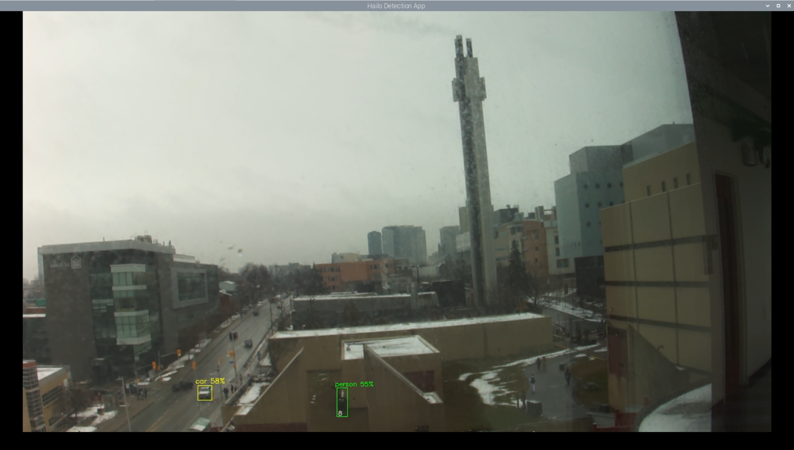
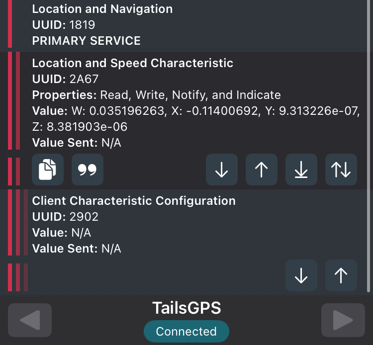
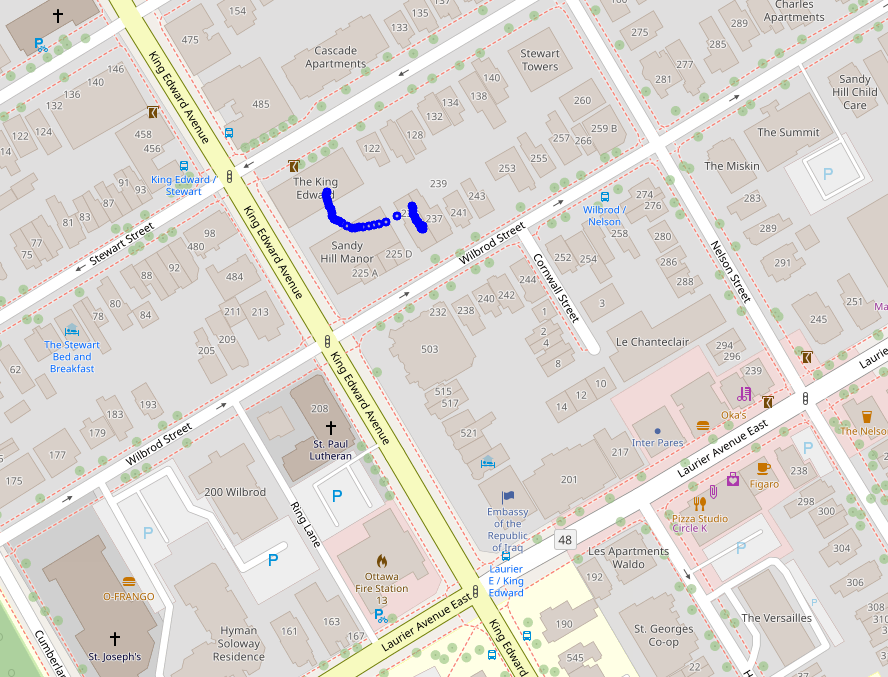

# TAILS Embedded System README

**Firmware Development for Tactical Aerial Insight and Localization Suite (TAILS)**  
By Frederick Andrews, Jad Mghabghab, Josué Dazogbo, Maureen Kouassi, Mouad Ben Lahbib,  Computer Engineering Students at the University of Ottawa  
Date: 3 July 2025

## Overview

**T.A.I.L.S.** (Tactical Aerial Insight and Localization Suite) is a drone-based **Point-of-Interest (POI)** mapping solution designed to enhance search and rescue operations, wildlife monitoring, and coastal surveillance. The system integrates **AI-powered image recognition** with **GPS tracking** to detect and mark important locations on an interactive map within a mobile application. This project involves expertise in **artificial intelligence**, **real-time embedded programming**, **wireless communication**, and **network security**.

<div align="center">
  
  <p><em>Figure 1: Assembled drone without onboard module mounted</em></p>
</div>

<div align="center">
  
  <p><em>Figure 2: Custom adjustable mount for Raspberry Pi High Quality Camera</em></p>
</div>

<div align="center">
  
  <p><em>Figure 4: Inference results from the onboard AI camera system</em></p>
</div>

This repository contains the embedded software developed for the **TAILS** (Tactical Aerial Insight and Localization Suite) system. The embedded code runs on a [Heltec WiFi LoRa 32 (V3)](https://heltec.org/project/wifi-lora-32-v3/) board and is responsible for communication, telemetry, and interfacing with onboard sensors (e.g. GPS, IMU). The firmware enables reliable transmission of drone location and sensor data via LoRa to a centralized receiver station.

<div align="center">
  
  <p><em>Figure 3: BLE debug interface showing real-time GPS location data</em></p>
</div>

<div align="center">
  
  <p><em>Figure 5: Interactive map highlighting Points of Interest based on GPS data</em></p>
</div>

The project is written in C++ and built using the [Arduino framework](https://www.arduino.cc/), targeting a modified ESP32 microcontroller, with additional support for SX1262-based LoRa modules and UBlox GPS receivers.

## Features
- 🧠 **AI Object Detection & POI Recognition**: Point of Interest (POI) object detection enables automated identification of key landmarks or objects; selectable via configuration on mobile app.
- 🛰️ **LoRa Telemetry Transmission**: Real-time transmission of position and altitude data.
- 📍 **GPS Integration**: Reads NMEA sentences and parses location data from UBlox modules.
- 📡 **BLE Peripheral Support**: Allows configuration and basic diagnostics over BLE.

## Repository Structure

```bash
TAILS-Embedded/
├───GroundNode # Embedded code running on the base station
│   └───HeltecLoRaApp
│           BLEInterface.cpp
│           BLEInterface.h
│           HeltecLoRaApp.ino
├───OnBoardNode/ # Embedded code running on the drone’s board
│   └───apps
│           detection.py
│           detection_ai.py
│           instance_segmentation.py
│           LoRaTest.py
│           pose_estimation.py
│          __init__.py
|     ...
└── README.md               # This document
```

## Bill of Materials (BOM)

Below is a detailed list of hardware components used for the **TAILS Embedded System**, with all costs shown after tax.

### 🔧 Hardware Components

| Item Description | Quantity | Cost After Tax ($) |
|------------------|----------|---------------------|
| [Raspberry Pi Zero 2 W + AI Camera + Accessories](https://www.raspberrypi.com/products/raspberry-pi-zero-2-w/) | 1 | 240.01 |
| [Raspberry Pi 5 (16GB) + Accessories](https://www.pishop.ca/product/raspberry-pi-5-16gb/?src=raspberrypi) | 1 | 304.30 |
| [Raspberry Pi HQ Camera + Lens](https://www.raspberrypi.com/products/ai-camera/) | 1 | 137.24 |
| [USB to LoRa Dongle](https://www.pishop.ca/product/usb-to-lora-dongle-915-mhz/) | 1 | Included Above |
| [Heltec LoRa Board (Base Station)](https://www.amazon.ca/-/fr/gp/product/B086ZFCV7F?smid=A2RJ79XBQX6W3M&psc=1) | 1 | 41.69 |
| [SX1262 LoRa Hat](https://www.amazon.ca/SX1262-LoRaWAN-GNSS-HAT-Expansion/dp/B0D4DPB68J) | 1 | 52.93 |
| [AI Accelerator Hat (Hailo-8L)](https://hailo.ai) | 1 | 123.06 |
| [PHAT-GPM GPS Module](https://canada.newark.com/designer-systems/phat-gpm/gps-module-raspberry-pi-rohs-compliant/dp/45AJ6805) | 1 | 55.99 |
| [Raspberry Pi UPS Power HAT](https://www.pishop.ca/product/uninterruptible-power-supply-ups-hat-for-raspberry-pi-zero-stable-5v-power-output/) | 1 | 77.79 |
| [Adjustable Camera Mount](https://www.pishop.ca/product/universal-tilt-adjustable-mount-for-raspberry-pi-camera/) | 1 | 35.65 |
| Drone Parts (Motors, Frame, ESC, etc.) | — | 754.77 |
| Accessories (Cables, spacers, mounts, etc.) | — | 159.67 |
| [Drone Assembly Fee (StansUAV)](https://stansuav.ca/) | 1 | 339.00 |
| **Total Project Cost** | — | **2,322.10** |
