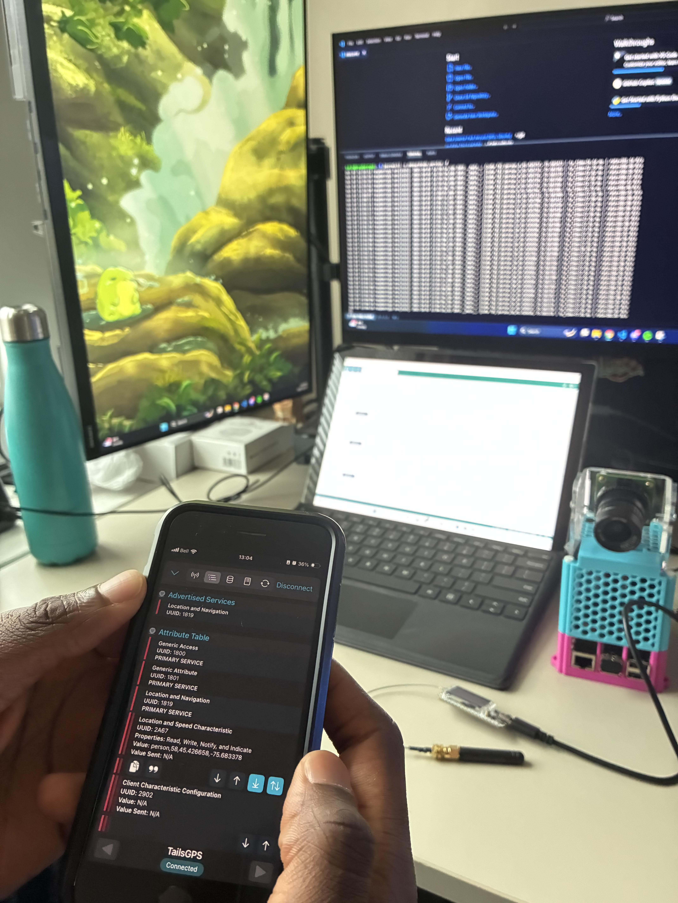

# T.A.I.L.S. — On Board Node

By Frederick Andrews, Jad Mghabghab, Josué Dazogbo, Maureen Kouassi, Mouad Ben Lahbib, Computer Engineering Students at the University of Ottawa
Date: 7 October 2025

## Overview

The **On Board Node** is the aerial intelligence and sensing module of the **T.A.I.L.S. (Tactical Aerial Insight and Localization Suite)** system.
It is mounted on a **drone platform** and built around a **Raspberry Pi 5**, equipped with a **Hailo-8L AI accelerator**, a **LoRa-GPS module**, and a **Raspberry Pi High Quality Camera**.

This module performs **real-time object detection**, **GPS-based localization**, and **LoRa telemetry transmission** to the **Base Station (Ground Node)**.
The onboard node captures live video streams, detects Points of Interest (POIs) such as humans or vehicles, and transmits both detection results and positional data for mapping in the TAILS mobile app.

<div align="center">
  
  <p><em>Figure 1: Raspberry Pi HQ Camera and Hailo AI Hat mounted on drone</em></p>
</div>


## Features

* 🧠 **AI Object Detection**: Performs onboard inference using a Raspberry Pi and Hailo-8L accelerator.
* 📸 **High-Resolution Imaging**: Captures real-time video and stills with the Raspberry Pi HQ Camera.
* 📍 **GPS Telemetry**: Reads coordinates from the LoRa-GPS module and attaches them to detection data.
* 📡 **LoRa Transmission**: Sends structured telemetry packets to the base station for BLE rebroadcast.
* 🔋 **Power-Efficient Operation**: Powered by a drone-mounted UPS HAT and LiPo battery system for self sufficiency.

## Hardware

* **Raspberry Pi 5** (Main processor)
* **Hailo-8L AI Accelerator Hat** for onboard inference
* **Raspberry Pi HQ Camera** (12.3 MP sensor, C/CS-mount lens)
* **SX1262/L76X LoRa-GPS Module** for long-range communication and localization
* **5V UPS HAT** for stable power delivery
* **Drone Power System** (LiPo battery, ESCs, and flight controller)


## Software Architecture

The onboard software is written in Python and is organized for modularity and maintainability. It uses computer vision and hardware libraries (for example: OpenCV, Ultralytics/YOLO-style models or Hailo SDK for the Hailo accelerator, and pyserial for serial/GPS/LoRa links). Dependency manifests are kept in `src/requirements.txt` and `src/vision/requirements.txt`.

Data flow (high level):

1. Camera Capture — Frames are captured from the HQ Camera.
2. AI Inference — Each frame is processed by the vision pipeline (Hailo-enabled code paths are under `src/vision/`).
3. Telemetry Construction — GPS coordinates (from `src/core/gps`) are paired with detections to build a structured telemetry packet.
4. LoRa Transmission — Packets are transmitted by the LoRa driver in `src/transmitter/` to the Base Station for further rebroadcast (BLE).

<div align="center">
  
  <p><em>Figure 2: End-to-end test with terminal output captured during integration testing</em></p>
</div>


Repository layout (relevant parts):

```
OnBoardNode/
├── src/
│   ├── main.py                 # Main entry: initializes camera, model, GPS polling, transmitter
│   ├── core/
│   │   └── gps/                # GPS drivers and manager (L76X driver, gps_manager)
│   │   └── transmitter/        # LoRa transmitter drivers (SX126x)
│   │   └── vision/             # Vision pipelines, Hailo integration, and C++ helpers
│   ├── environment_setup/      # Scripts and venv for environment setup
│   └── utils/                  # Helper utilities (distance, plotting, etc.)
└── README.md
```

Key scripts and components:

- `src/main.py` — Project entry point that wires camera, model, GPS, and transmitter.
- `src/core/gps/gps_manager.py` — GPS polling and parsing logic.
- `src/core/gps/L76X.py` — Low-level driver for the L76X GPS module (serial parsing, NMEA handling).
- `src/transmitter/SX126x.py` — LoRa radio control and packet transmit/receive routines.
- `src/vision/hailo_apps_infra/detection_pipeline.py` — Vision inference pipeline and postprocessing.

This layout reflects the actual repository structure and keeps hardware abstraction, vision inference, and communication layers separated so they can be developed and tested independently.